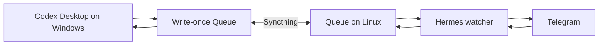

# Hermes–Codex Bridge

## Promise

Hermes–Codex Bridge carries safe Codex Desktop notifications to Telegram and routes an exact Telegram Reply back to the same originating Codex task. It is a self-hosted, two-host bridge: Windows owns Codex interaction handling, Linux owns Hermes and Telegram delivery, and Syncthing moves only a dedicated write-once Queue between them.

## Status

**Production-ready for self-hosted use.** The release includes guarded installers, ownership-aware uninstallers, redacted diagnostics, a guided Codex setup prompt, unit tests, and local end-to-end tests. Production readiness assumes that you operate both hosts, protect the Hermes credential file, and verify Syncthing convergence before enabling live delivery.

## What You Get

Codex → Telegram → Reply → same originating thread.

- Safe final responses, explicit questions, and one-time approval requests from the primary Codex task in Telegram.
- An exact Telegram Reply route, bound to the original bridge message and returned to the same originating Codex task.
- Offline durability: a write-once Queue waits for Syncthing, Hermes, Windows, or Codex Desktop to return instead of silently dropping the interaction.
- Approval choices limited to approve once or decline; no permanent approval is granted through Telegram.
- Redacted health reports that expose stable status codes, not tokens, chat IDs, Queue payloads, or private local paths.

## Architecture



Each side is the exclusive writer for its own records. Syncthing transports the records but is not trusted to resolve application-level conflicts. See [Architecture](docs/ARCHITECTURE.md) for ownership, routing, and failure semantics.

## Prerequisites

- Windows 10/11 with PowerShell 7, Node.js 24 or newer, Codex Desktop/CLI, and a writable Codex home.
- A Linux host with Python 3, systemd, `sudo`, a non-root `hermes` service account, and [Hermes Agent](https://github.com/NousResearch/hermes-agent) already working with Telegram.
- Syncthing on both hosts, paired through a trusted channel and configured with one dedicated **Send & Receive** folder.
- Authority to configure each host separately. Windows approval does not imply SSH, Linux, Telegram, or Syncthing approval.

## 10-Step Quick Start

> **Guided path:** open [the master Codex installation prompt](prompts/INSTALL_WITH_CODEX.md), copy it into Codex from the root of a trusted clone, and let Codex discover, plan, ask for approval, install, and verify each authorized host.

1. Clone this repository on the Windows host and review the [security model](docs/ARCHITECTURE.md#security-boundaries).
2. Install Hermes from its [official repository](https://github.com/NousResearch/hermes-agent), verify `hermes`, complete a normal local Hermes chat, run `hermes gateway setup`, and prove a normal Telegram conversation before adding the bridge.
3. Pair the two Syncthing devices, create one dedicated **Send & Receive** folder, use that folder as the Windows integration root, configure `.stignore` and autostart, then prove two-way convergence with the [Syncthing guide](docs/SYNCTHING.md).
4. Give Codex the [master installation prompt](prompts/INSTALL_WITH_CODEX.md). Keep all absolute paths local and never paste Telegram credentials into chat.
5. Let Codex run the Windows prerequisite checker and installer `-WhatIf` plan, then inspect its redacted target list.
6. Explicitly approve only the reviewed Windows mutation; install first with `-UiRouterMode external` and require a fresh service heartbeat.
7. Wait for `v3/hermes` to converge into the Linux shared root; on that separately authorized host, prepare the Hermes service identity, create the protected env file locally, review the synced installer plan, and separately approve `--apply` by following [Install Hermes](docs/INSTALL-HERMES.md).
8. Create the one dedicated Codex UI-router service task and paused automation, verify a bounded heartbeat and test action, then switch Windows to native router mode.
9. Run both redacted doctors and the repository test runner; fix every unhealthy stable code before live use.
10. Run the [real installation verification](prompts/VERIFY_INSTALLATION.md): send one harmless Codex question to Telegram and use Telegram Reply to prove it reaches the exact originating task.

## Security Properties

- Queue records are write-once, schema-validated, bounded, hashed, and owned by one producer.
- Telegram replies require an exact `HC3:<uuid>` route from the replied-to bridge message; unthreaded text cannot select a Codex task.
- Windows installation and removal require a matching ownership manifest and reject symlink, junction, and reparse-point targets before reading or mutation.
- Hermes installation and uninstall use staged transactions, provenance checks, a non-root service account, and rollback on failure.
- Telegram token and chat ID exist only in a protected local env file on Linux. They are never required on Windows or in chat.
- Doctors return redacted JSON and stable codes. They do not contact Telegram or print private paths.
- Approval is one-time only, expires after 12 hours, and can be declined. Other replyable interactions expire after at most seven days.

## Supported Events and Actions

| Event | Telegram action | Result |
|---|---|---|
| `FINAL_RESPONSE` | Reply | Starts one continuation in the exact originating task when it is still current. |
| `QUESTION` / `LIVE_REQUEST` | Reply | Resolves the live Codex question without creating another task. |
| `QUESTION` / `NEXT_TURN` | Reply | Starts one exact-task continuation only if the interaction is still current. |
| `APPROVAL_REQUEST` | Exact approve-once phrase shown in Telegram | Grants only the pending operation once. |
| `APPROVAL_REQUEST` | Exact decline phrase shown in Telegram | Declines the pending operation. |
| `ERROR` | None | Delivers a bounded failure notice; it cannot authorize work. |

Protocol v3 also reserves `TASK_COMPLETED` for additive producers. The current Windows adapters normally emit final responses, questions, approval requests, and errors.

## Tests

From the repository root:

```powershell
Push-Location ./bridge
npm test
Pop-Location
python -m unittest discover -s ./hermes -p 'test_*.py' -v
pwsh -NoProfile -File ./tests/Run-V3Tests.ps1
```

The unified runner covers Node and Python units plus local, adaptive-routing, and native-router E2E paths. Live Telegram delivery remains a separately approved verification because automated tests do not request real credentials.

## Limitations

- The bridge **does not start arbitrary new Codex tasks from unthreaded Telegram messages**. The user must use Telegram Reply on a routed bridge message.
- Codex Desktop and the one-minute native router automation must run for a Reply to become visible. The Queue retains pending work while they are offline.
- Syncthing is transport, not backup. Use a separate backup system for Queue audit data and configuration.
- Only the primary task's useful final reports and questions are delivered. Internal child-subagent and reviewer finals are suppressed, and that suppression remains sticky even when inherited metadata appears later.
- A busy task is never interrupted; its Reply waits and may later become stale if local work advances first.

## Documentation

- [Architecture and trust boundaries](docs/ARCHITECTURE.md)
- [Install the Windows/Codex side](docs/INSTALL-CODEX.md)
- [Install the Linux/Hermes side](docs/INSTALL-HERMES.md)
- [Configure Syncthing safely](docs/SYNCTHING.md)
- [Use the bridge](docs/USAGE.md)
- [Configuration reference](docs/CONFIGURATION.md)
- [Troubleshooting by stable code](docs/TROUBLESHOOTING.md)
- [Uninstall and recovery](docs/UNINSTALL.md)
- [Queue protocol v3](protocol/v3/PROTOCOL.md)

## Contributing

Keep the ownership boundary and write-once protocol intact. Add a failing contract or E2E test before changing behavior, keep examples synthetic, and run the full v3 suite before proposing a change. Security reports should describe stable codes and reproduction conditions without credentials, Queue payloads, or private paths.

## License

This project is distributed under the MIT License. The published release includes the license text at the repository root.

## Independence Disclaimer

This independent community project is not affiliated with OpenAI, Telegram, Syncthing, or Nous Research. Product and project names belong to their respective owners.
