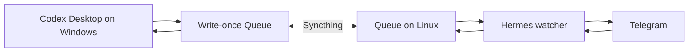

# Architecture

Hermes–Codex Bridge separates a Windows/Codex authority from a Linux/Hermes authority and joins them with a dedicated Syncthing folder. The separation is deliberate: Codex never needs the Telegram credential, and Hermes never needs access to Codex sessions or workspaces.



## Design Constraints

- Both hosts can be offline independently, so delivery must survive restarts without replay.
- Syncthing is eventually consistent and can expose partial or conflicting files, so a process must not treat folder presence as a transaction.
- A Telegram message does not identify a Codex task unless it is a Reply to a bridge message carrying the exact route.
- Installers run with enough authority to create services; therefore they must fail closed on ambiguous ownership or path indirection.
- Diagnostics are often copied into support conversations; therefore their public contract contains stable codes and no configured values.

These constraints lead to a file protocol rather than a shared database or inbound public endpoint. The bridge remains self-hosted, works across offline intervals, and adds no internet-facing service beyond the user's existing Hermes/Telegram gateway.

## Components

| Component | Authority and responsibility |
|---|---|
| Windows service | Watches primary Codex sessions, applies notification policy, publishes events, validates replies, and routes an accepted Reply. |
| Codex UI router | A dedicated service task and one bounded automation claim native UI actions, report a heartbeat, and send to exact task IDs. |
| Queue v3 | Stores one immutable interaction directory per event under `Queue/bridge/v3/interactions`. |
| Syncthing | Replicates the dedicated shared folder in both directions; it does not decide application state. |
| Hermes watcher | Validates Windows-owned events, sends Telegram messages, and records delivery evidence. |
| Hermes reply skill/runtime | Accepts only an exact Telegram Reply route, validates the sender locally, and publishes one reply record. |

The installed Hermes layout is rendered from `hermes/templates/hermes-codex-bridge.service.in` and `hermes/templates/SKILL.md.in` by `hermes/scripts/install.sh`. Templates keep machine-specific paths out of source control, while the installer owns the rendered unit, runtime, state, and bridge skill through a provenance manifest.

## Write-Once Ownership

Each committed record has one writer:

| Record | Writer |
|---|---|
| `event.json`, optional `message.md`, Windows failures, terminal receipts | Windows |
| `delivery.json`, `reply.json`, Hermes failures | Hermes |
| `ui-action.json`, claims, applied evidence | Windows/native router contract |

Writers create a private partial file, sync it, and rename without replacement. Readers validate schema, byte limits, hashes, event identity, expiry, and directory boundaries. An existing unequal record is an integrity conflict, never permission to overwrite. This is why retries are idempotent and why Queue history is preserved during uninstall.

## Exact-Task Routing

Hermes puts `HC3:<uuid>` near the top and at the footer of each bridge message. Telegram Reply supplies the actual replied-to message ID and sender identity to the local Hermes runtime. That runtime accepts the route only when the delivery record, owner fingerprint, action, TTL, and event agree.

Windows then checks that the interaction is still current. A live question resolves the pending request. A completed question or final response can create one next turn in the exact originating task. In native mode, plaintext stays out of `ui-action.json`; the dedicated Codex router sends the already validated reply and records visible application evidence.

The router's service-task identity is registered explicitly. It is not guessed from a title or recent activity. Internal subagent and reviewer final outputs are suppressed; the suppression is sticky across later inherited metadata. Primary task final reports, questions, and approvals remain deliverable.

## Adaptive Delivery

The notification gate uses only coarse Windows presence: `DESK`, `AWAY`, or `UNKNOWN`. It does not capture keys, screen content, or window text. Explicit questions can leave immediately when the user is away; normal finals are briefly stabilized so an internal phase boundary does not look like a finished task. A local response cancels or stales the matching Telegram candidate.

If the target task is busy, the router releases the action instead of interrupting active work. If local work advances before application, the Reply becomes stale and receives terminal rejection evidence rather than being sent to a newer context.

## Health Model

Installation success is stronger than file copy success. Windows starts the scheduled task and waits up to a bounded 15 seconds for a new service heartbeat. Native mode separately requires the router heartbeat. Hermes starts the systemd unit and the offline doctor requires a fresh watcher heartbeat, safe paths, protected environment shape, installed runtime files, and a Queue create/delete probe.

Doctors intentionally return redacted JSON such as:

```json
{"schema":"hermes-codex-bridge-doctor/v3","healthy":true,"checks":{"config":{"status":"ok","code":"DOCTOR_CONFIG_OK"}}}
```

The real installation gate additionally proves two-way Syncthing convergence and one live notification/Telegram Reply round trip. Process existence alone is insufficient.

## Security Boundaries

- Telegram token and chat ID stay only in a mode-`600` protected local env file on the Hermes host. They are not placed in Queue, Windows config, command arguments, templates, or chat.
- Absolute paths are accepted locally but never appear in redacted reports.
- Windows install/uninstall validates an ownership manifest and rejects symlink, junction, and other reparse components before manifest reads or mutation.
- Hermes validates physical path components, non-overlap with preserved roots, root-owned provenance in production, and a non-root service user.
- `allowedWorkspaceRoots` limits Codex operations; Queue, state, and Codex home cannot be nested into an allowed workspace.
- No ordinary or unthreaded Telegram message can select a task or create an arbitrary task.

## Failure and Recovery Model

Offline transport is expected. A committed write-once record remains pending until the other side returns. Malformed, expired, stale, unauthenticated, or conflicting records fail closed with bounded codes.

Both installers stage backups and attempt rollback when installation fails. Hermes uninstall is also transactional: it stops the service, captures a post-stop snapshot, quarantines manifest-proven targets, and restores prior service state on failure. Windows uninstall is deliberately more conservative but sequential; after mutation begins, `UNINSTALL_PARTIAL` requires an explicit recovery plan because completed removals are not automatically reconstructed.

The Queue, Syncthing configuration/data, Codex sessions, user workspaces, Hermes home, Hermes gateway, Telegram history, and user-created skills are preservation boundaries. See [Uninstall](UNINSTALL.md) for the exact commands and recovery rules.

## Alternatives Rejected

- A Telegram command that selects the “current” Codex task was rejected because recency and titles are ambiguous and can route sensitive text incorrectly.
- A shared mutable status file was rejected because Syncthing conflicts would make ownership and replay nondeterministic.
- Storing Telegram credentials on Windows or in Queue was rejected because it collapses the host boundary and makes synced data a secret store.
- Direct automation of every remote prerequisite was rejected because network reachability is not authority. The guided prompt hands work to the host owner unless separate SSH approval exists.
